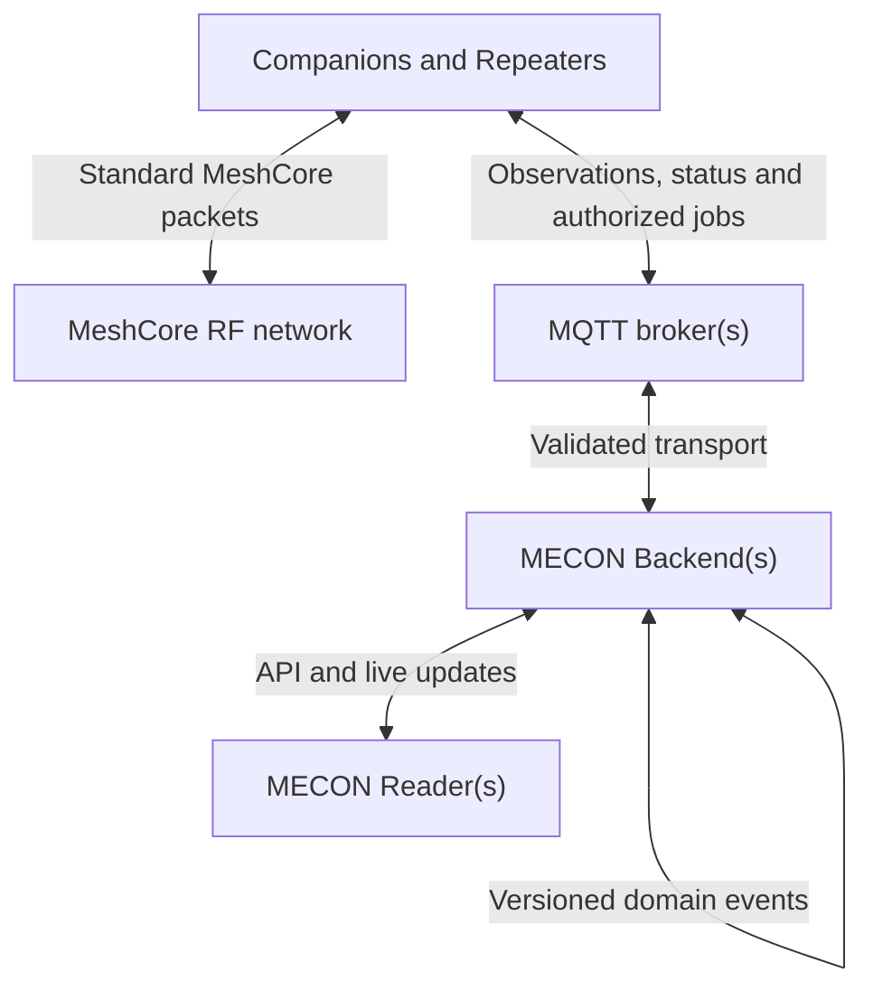

# Architecture

## Logical flow

Third-party repeaters and aggregators enter through MQTT ingestion adapters. They do not become separate MECON components.

## Canonical data model

One user-visible message can have several transport records:

- **Packet:** one logical MeshCore RF packet.
- **Observation:** one receiver reporting that packet.
- **Message:** the decrypted user-visible content.
- **Backfill:** delivery to an authorized Companion without another RF transmission.
- **Outage-sync copy:** an optional additional RF envelope used for explicitly configured offline synchronization.

Stable identifiers prevent repeated MQTT delivery, multiple observers or backend synchronization from creating duplicate user messages.

## Management boundary

Remote management is capability based and allowlisted. MQTT input must never become an arbitrary shell, NVS or radio-transmission interface.

A management job should include:

- protocol and schema version;
- target device identity;
- stable job identifier;
- issue and expiry times;
- replay protection;
- explicit requested operations;
- authenticated result states.

Device configuration should use standard templates plus per-device overrides. Companion and Repeater schemas differ where their native MeshCore capabilities differ.

## Federation boundary

Backends synchronize domain events rather than their databases. Each event must be:

- versioned;
- authenticated;
- idempotent;
- attributable to an instance;
- safe to replay;
- scoped to data the receiving instance is authorized to hold.

Conflict handling is part of each domain contract. Configuration changes use revisions; packet observations use stable identities and set-like reconciliation.

## Security boundary

Transport encryption alone does not make every MQTT client trusted. Device observation, integration, decryption and management permissions are distinct.

Secrets must be:

- explicitly enrolled;
- encrypted at rest and in transit;
- excluded from logs and sanitized snapshots;
- revocable;
- shared only with installations that require them.

The exact management trust and managed-OTA models require separate security designs before those capabilities can be considered generally available.

## Relationship to MeshCore

MeshContinuum is an independent overlay. MeshCore remains the radio protocol and the source of native Companion and Repeater behavior. A MECON-enabled device must continue standards-compatible operation when every MECON service is unavailable.
