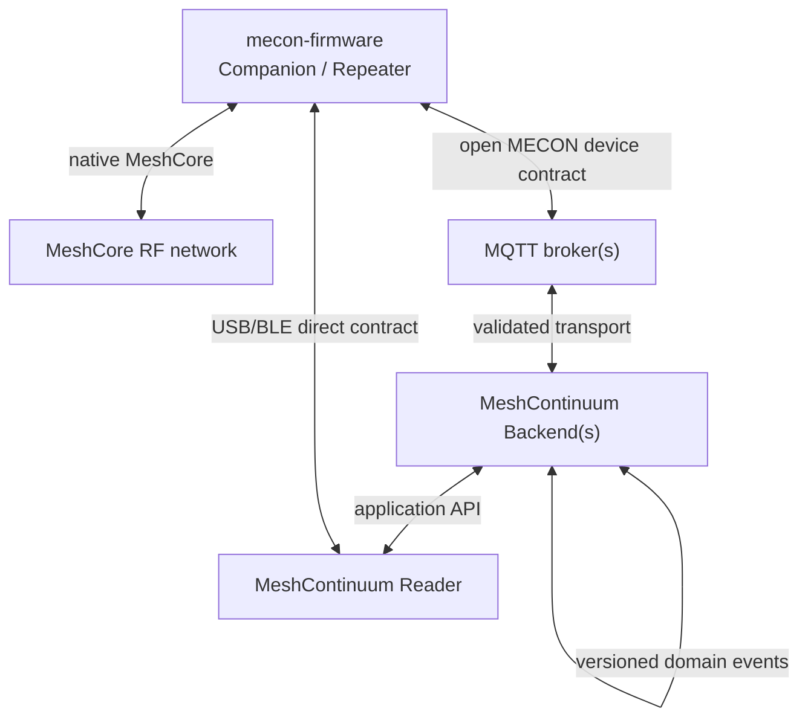

# Architecture

## Logical flow

The device-facing contract is canonical in [mecon-firmware](https://github.com/hoejriis/mecon-firmware), not in the MeshContinuum implementation. This lets other projects implement compatible backends/Readers.

## Offline/direct operation

MeshContinuum does not sit in the RF critical path. A mecon-firmware device retains its native MeshCore role without a Backend, broker, Wi-Fi or Internet connection.

A desktop Chrome/Edge Reader may attach directly to a Companion over USB/BLE (or a Repeater over USB). In standalone mode it can operate against local browser state and synchronize observations/messages later. In bridge mode it can expose the attached device to a reachable Backend without inventing a second firmware contract.

## Canonical application data model

One user-visible message can have several transport records:

- **Packet:** one logical MeshCore RF packet.
- **Observation:** one receiver reporting that packet.
- **Message:** decrypted user-visible content.
- **Delivery:** transport-specific evidence for an outbound/inbound logical message.

Stable identifiers prevent MQTT duplication, multiple observers, browser synchronization or backend federation from creating duplicate logical messages or duplicate RF sends.

## Management boundary

Management is capability/profile based and allowlisted. Observation, configuration read, messaging, administration and OTA are distinct authorities.

MeshContinuum presents the device's advertised schema/capabilities; it does not derive management behavior from board/role/version tables where the contract can answer directly.

## Multi-broker boundary

A supported firmware device may connect to two brokers concurrently. Each broker has independent credentials, namespace and grants. MeshContinuum may be one authorized backend while another project consumes observations from the second broker.

## Federation boundary

Backends synchronize versioned, authenticated, idempotent domain events rather than databases. Local installations remain independently useful during peer/WAN outages.

## Security boundary

MeshContinuum's application authorization and the firmware's device authority are separate layers. A MeshContinuum user may request an action only if both application authorization and the target device/broker grant permit it.

Private identities, Wi-Fi credentials, broker credentials and other secrets are never ordinary status data. Firmware OTA uses approved signed manifests rather than arbitrary image URLs.

## Relationship to MeshCore

MeshCore remains the RF protocol and source of native Companion/Repeater behavior. MeshContinuum and mecon-firmware add optional management/connectivity around it; neither requires changing the MeshCore RF protocol.