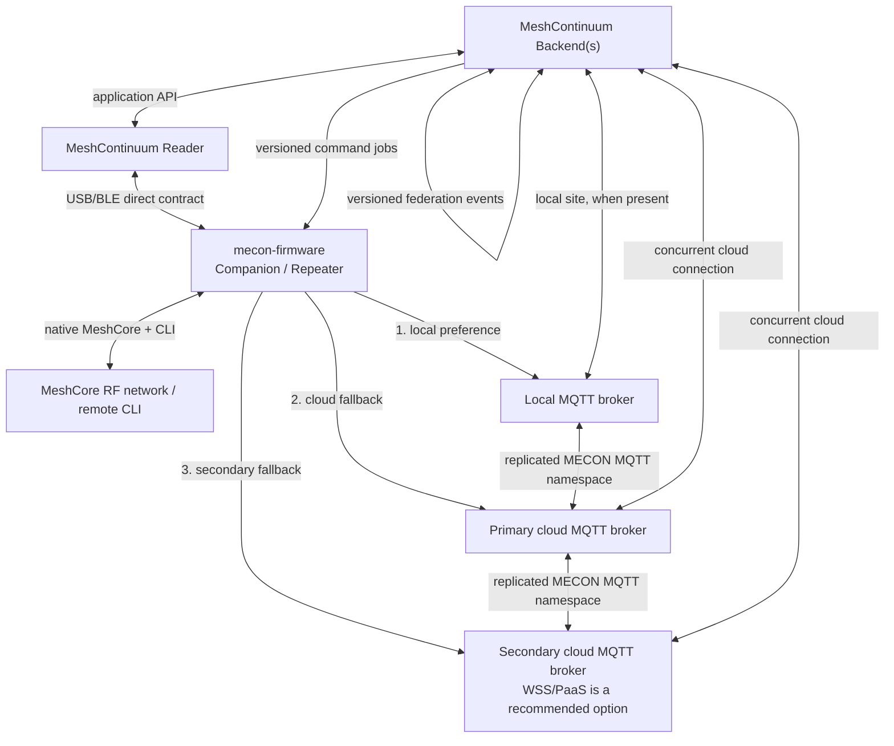

# Architecture

> **Target documentation:** this public repository has no installable release yet. See the [shared capability matrix](CAPABILITIES.md) for current availability and acceptance; specifications do not certify hardware or release readiness.

## Design principles

MeshContinuum is local-first and self-hostable. A small local installation is a complete product; cloud services add reachability and resilience rather than becoming prerequisites for MeshCore operation.

One MECON **Deployment** represents one administrator/trust domain and has a human-readable name, for example `DeimosMesh`, plus a permanent cryptographic Deployment identity. The Deployment name is also the default name of its private offline sync channel. A self-hosting administrator owns the Deployment's infrastructure and credentials. MECON does not require a shared public MQTT hub.

## Logical flow


```mermaid
flowchart TD
    RF["MeshCore RF network / remote CLI"]
    FW["mecon-firmware\nCompanion / Repeater"]
    LOCAL["Local MQTT broker"]
    PRIMARY["Primary cloud MQTT broker"]
    SECONDARY["Secondary cloud MQTT broker\nWSS/PaaS is a recommended option"]
    BE["MeshContinuum Backend(s)"]
    READER["MeshContinuum Reader"]

    FW <-->|"native MeshCore + CLI"| RF
    FW -->|"1. local preference"| LOCAL
    FW -->|"2. cloud fallback"| PRIMARY
    FW -->|"3. secondary fallback"| SECONDARY
    LOCAL <-->|"replicated MECON MQTT namespace"| PRIMARY
    PRIMARY <-->|"replicated MECON MQTT namespace"| SECONDARY
    BE <-->|"local site, when present"| LOCAL
    BE <-->|"concurrent cloud connection"| PRIMARY
    BE <-->|"concurrent cloud connection"| SECONDARY
    BE <-->|"application API"| READER
    READER <-->|"USB/BLE direct contract"| FW
    BE -->|"versioned command jobs"| FW
    BE <-->|"versioned federation events"| BE
```

The exact broker bridge topology may vary as long as the defined replicated namespace converges without loops or duplicate execution.

## Device management architecture

MeshContinuum treats the firmware's **MeshCore CLI/configuration plane as the canonical management semantics for native MeshCore behaviour**. MECON extends that plane for MECON-owned behaviour rather than defining independent configuration models for USB, BLE, MQTT and LoRa.

The backend and Reader therefore operate in terms of logical allowlisted operations with request/job identity, arguments, authority and correlated results. The transport adapter may carry those operations over MQTT, USB, BLE or, through a Companion, MeshCore RF/LoRa. Transport choice does not change the meaning, validation or persistence of a setting.

For native settings/operations, released MeshCore 1.18 remains authoritative. MECON firmware must not mirror native radio/name/location/routing/GPS/etc. into a second authoritative settings database. Structured schema/get/apply APIs remain useful to MeshContinuum for UI generation and atomic multi-field changes, but they orchestrate the canonical CLI/configuration operations rather than replace them.

Remote nodes should be managed using released MeshCore authenticated CLI/command mechanisms where available. Conceptually:

```text
MeshContinuum Backend / Reader
          │
     command envelope
          │
   MQTT / USB / BLE
          │
  local MECON Companion
          │
     MeshCore RF/LoRa
          │
 remote target CLI/config
```

MECON adds correlation, authorization policy, replay/idempotency, auditing and compact transport encoding where needed. It does not introduce a proprietary RF settings protocol when upstream CLI can express the operation.

The detailed firmware contract lives in `hoejriis/mecon-firmware/docs/contract/`; the consolidated pre-1.0 architecture is `TARGET_FIRMWARE_CONTRACT_0.9.md`. Exact mappings are frozen after released MeshCore 1.18 is pinned.

## Deployment identity and keys

MECON deliberately separates credentials by purpose rather than using one universal master key.

- **Deployment trust root / identity:** establishes continuity of one Deployment and authorizes Backend membership. Backend instances have their own instance identities rather than sharing one ordinary operational private key.
- **Backend instance identity:** identifies and authenticates one trusted Backend to its peers.
- **Offline sync-channel key:** shared with enrolled Companions and trusted Backends for the Deployment's private MeshCore sync channel. Because Companions possess this shared secret, loss/revocation of a Companion triggers sync-key rotation and redistribution to remaining authorized devices.
- **Per-device MQTT identity/credential:** identifies one Companion to the Deployment's local/primary/secondary brokers and can be revoked individually. Possession of the offline sync key is not sufficient to mint an MQTT identity.
- **Recovery material:** optional disaster-recovery authority stored only on explicitly designated Recovery Companions and protected by a user passphrase.

MQTT transport identity and MECON cryptographic identity remain separate. Broker replacement/failover does not change device or Backend identity.

## Offline sync channel

Every Deployment has a private offline sync channel whose default name is the Deployment name. Enrolled Companions receive its current private key/generation so that authorized devices can participate in offline MECON coordination and can assist with enrollment flows when Backend connectivity is unavailable.

The shared channel is intentionally not the Deployment trust root. A device possessing the sync key cannot unilaterally become a Backend, mint arbitrary broker credentials or impersonate the Deployment root.

When a Companion is lost or revoked:

1. revoke that device's individual MQTT/broker authority;
2. increment the offline sync-key generation;
3. create a new sync-channel private key;
4. distribute the new generation to remaining authorized devices/Backends through available trusted paths;
5. retain only the historical material required to interpret retained data, according to policy.

## Cold recovery

An administrator may designate one or more enrolled Companions as **Recovery Companions**. Each Recovery Companion independently holds an encrypted, versioned Recovery Package. Recovery v1 is not quorum-based: any current Recovery Companion plus its user-chosen passphrase can recover the Deployment.

MECON does not impose passphrase complexity. The UI should explain the consequences of a weak passphrase and may provide strength guidance, but the administrator chooses the passphrase.

### Two-part recovery authority

A Recovery Companion does not store a directly usable plaintext master key. It stores an encrypted recovery package protected by a key derived from the user's passphrase with a documented password KDF and per-package salt/parameters.

Therefore neither possession of the Companion nor knowledge of the passphrase alone is sufficient.

### USB-only recovery

Cold recovery is intentionally physical and narrow:

1. start a fresh MECON Backend/Reader;
2. choose **Recover existing Deployment**;
3. physically connect a Recovery Companion over USB to the browser running the fresh Reader;
4. Reader/WebSerial reads the opaque Recovery Package;
5. user enters the passphrase;
6. recovery material is decrypted in the browser where practical and used to establish continuity of the recovered Deployment;
7. fresh Backend instance and broker operational credentials are generated;
8. the offline sync key is rotated as part of recovery before normal operation resumes.

Recovery is not exposed over RF, MQTT or BLE. Firmware should not remotely advertise a Recovery Companion as a high-value target; the recovery package is accessible only through the explicit USB recovery operation.

### Recovery Package v1

The package contains only high-value information that cannot safely/reliably be reconstructed from surviving devices or re-entered by the administrator. Expected contents are:

- package format/version and recovery generation;
- permanent Deployment ID and Deployment name;
- cryptographic material required to prove/re-establish Deployment trust-root continuity;
- trust-root/key generation metadata required to interpret that material;
- current offline sync-channel identity, private key and generation;
- cryptographic/KDF metadata required to authenticate/decrypt the package.

It deliberately does **not** become a configuration backup. Do not store ordinary Wi-Fi presets, broker endpoints/passwords, retention settings, UI preferences, observations/history, routine device configuration, templates or similar reconstructable settings. Users, favourites and other state already represented on surviving Companions should be reconstructed/synchronized from those devices where the contracts provide sufficient evidence rather than duplicated into the Recovery Package.

### Recovery generations

Recovery Packages have a monotonic generation. Fundamental recovery/trust changes create a new generation and update designated Recovery Companions. A recovered Backend can identify an older package as stale. Removing/revoking a Recovery Companion must advance the relevant recovery authority so its old package cannot be treated as current indefinitely.

Cold recovery proves Deployment continuity; it does not blindly resume all old operational credentials. New Backend/broker credentials are generated and the offline sync key is rotated during recovery.

## Deployment components

A Deployment may contain one permanent Deployment identity, 1..n Backend instances, 0..n Readers, one primary cloud broker, one secondary cloud broker, 0..n local brokers and enrolled devices. Neither cloud broker is required locally.

## Recommended deployment progression

### Small local deployment

Start with one Docker host containing Backend, Reader, local MQTT broker and persistent application/broker state. First-run setup provisions Deployment identity, broker credentials and ACLs without manual MQTT administration.

### Hybrid deployment

Add a primary cloud broker while leaving Backend/Reader/database local. Backend connections are outbound; public application ingress is optional.

### Resilient deployment

Add an independently hosted secondary broker. A recommended pattern is primary on an ordinary VPS and secondary as a lightweight PaaS broker-only service using secure MQTT over WebSocket behind managed TLS. The PaaS node needs no Backend, Reader or application database.

## MQTT transport model

MQTT over TLS/TCP and MQTT over secure WebSocket are equivalent MECON transports. Topics, authentication, ACL semantics, event identity and application behaviour are independent of socket transport.

IP-capable devices maintain one active session in priority order: authenticated local broker, primary cloud broker, secondary cloud broker. Backends connect concurrently to both configured cloud brokers and additionally to their local broker when applicable.

## Broker replication boundary

Brokers replicate the defined MECON MQTT namespace needed to make operation independent of the currently connected broker. Topic classes include local-only, ephemeral, replicated transient, replicated retained, durable-until-acknowledged commands/jobs, acknowledgements/results and presence/status with expiry. Stable IDs and idempotency prevent replay/multipath delivery from executing actions twice.

Brokers are not MECON databases. Long-term observations, users, application records and authoritative history belong to Backends.

## Backend federation boundary

Trusted Backends synchronize versioned, authenticated, idempotent domain events and recover through verified snapshots. They are equal peers; there is no privileged cloud database primary. Broker replication keeps operational MQTT transport available; Backend federation converges authoritative application/database state. Federation is not backup.

## Offline/direct operation

MeshContinuum does not sit in the RF critical path. A mecon-firmware device retains native MeshCore operation without Backend, broker, Wi-Fi or Internet. Local Backend/Reader/broker sites remain useful during Internet failure. Desktop Reader may also attach directly over USB/BLE according to device capability.

## Canonical application data model

One user-visible message can have several transport records: Packet, Observation, Message and Delivery. Stable identifiers prevent MQTT duplication, multiple observers, browser synchronization or Backend federation from creating duplicate logical messages or RF sends.

## Management boundary

Management is capability/profile based and allowlisted. Observation, configuration read, configuration write/administration, messaging, recovery and OTA are distinct authorities. Recovery authority is never implied by ordinary enrollment or MQTT access. Canonical CLI semantics do not imply arbitrary shell access.

## Security boundary

Brokers need enough credential/ACL state to authorize transport but do not require MeshCore private identities, channel/message decryption keys, Deployment recovery material or the authoritative MECON trust graph simply to transport MQTT material.

Private identities, Wi-Fi credentials, broker credentials and recovery material are never ordinary status data. MeshContinuum application authorization and firmware device authority remain separate layers.

## Relationship to MeshCore

MeshCore remains the RF protocol, source of native Companion/Repeater behavior **and source of native CLI/configuration semantics**. MeshContinuum and mecon-firmware add optional management/connectivity around it; neither requires changing the MeshCore RF protocol.