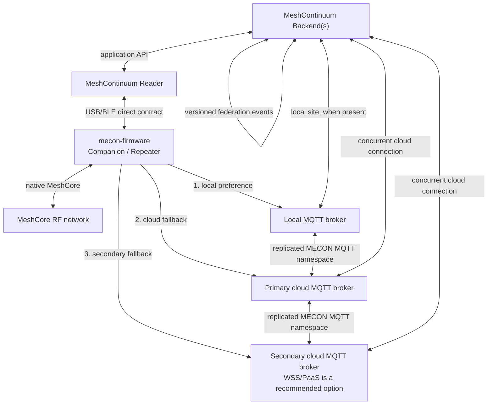

# Architecture

## Design principles

MeshContinuum is local-first and self-hostable. A small local installation is a complete product; cloud services add reachability and resilience rather than becoming prerequisites for MeshCore operation.

One MECON **Deployment** represents one administrator/trust domain. A self-hosting administrator owns the Deployment's infrastructure and credentials. MECON does not require a shared public MQTT hub.

## Logical flow

```mermaid
flowchart TD
    RF["MeshCore RF network"]
    FW["mecon-firmware\nCompanion / Repeater"]
    LOCAL["Local MQTT broker"]
    PRIMARY["Primary cloud MQTT broker"]
    SECONDARY["Secondary cloud MQTT broker\nWSS/PaaS is a recommended option"]
    BE["MeshContinuum Backend(s)"]
    READER["MeshContinuum Reader"]

    FW <-->|"native MeshCore"| RF
    FW -->|"1. local preference"| LOCAL
    FW -->|"2. cloud fallback"| PRIMARY
    FW -->|"3. secondary fallback"| SECONDARY

    LOCAL <-->|"replicated MECON MQTT namespace"| PRIMARY
    PRIMARY <-->|"replicated MECON MQTT namespace"| SECONDARY

    BE <-->|"local site, when present"| LOCAL
    BE <-->|"concurrent cloud connection"| PRIMARY
    BE <-->|"concurrent cloud connection"| SECONDARY
    BE <-->|"application API"| READER
    READER <-->|"USB/BLE direct contract"| FW
    BE <-->|"versioned federation events"| BE
```

The exact broker bridge topology may vary as long as the defined replicated namespace converges without loops or duplicate execution. A local-to-cloud fabric plus primary/secondary cloud bridge is preferred over an unnecessary full mesh where it satisfies the contract.

The device-facing contract is canonical in [mecon-firmware](https://github.com/hoejriis/mecon-firmware), not in the MeshContinuum implementation. This lets other projects implement compatible Backends/Readers.

## Deployment components

A Deployment may contain:

- one permanent Deployment identity;
- 1..n Backend instances;
- 0..n Reader deployments;
- one primary cloud MQTT broker when Internet reachability is desired;
- one secondary cloud MQTT broker when independent fallback is desired;
- 0..n local MQTT brokers, normally one for each site requiring offline operation;
- enrolled MECON/MeshCore devices.

Neither cloud broker is required for a local-only installation.

## Recommended deployment progression

### Small local deployment

The recommended starting point is one Docker host containing:

- Backend;
- Reader;
- local MQTT broker;
- persistent Backend/database and broker state.

The installation should provision its Deployment identity, local broker credentials and ACLs through a guided first-run flow rather than requiring manual MQTT administration.

### Hybrid deployment

Add a primary cloud broker while leaving Backend/Reader/database local. The Backend makes outbound broker connections, so application services do not need public Internet ingress merely to support remotely connected devices.

### Resilient deployment

Add an independently hosted secondary cloud broker. A recommended pattern is:

- primary: ordinary VPS or equivalent, typically secure MQTT/TCP and/or WSS;
- secondary: lightweight PaaS broker-only deployment, for example a Render-style Web Service using MQTT over secure WebSocket behind managed HTTPS/TLS ingress.

The PaaS service needs no Backend, Reader or application database. It is a transport node with the broker persistence/queueing required by the MQTT replication contract.

This deliberately allows the primary and secondary to have different hosting/network failure modes.

## MQTT transport model

MQTT is a logical transport contract, not a mandated socket type.

Supported secure public transports include:

- MQTT over TLS/TCP, commonly exposed directly by VPS/broker hosts;
- MQTT over secure WebSocket (WSS), suitable for PaaS platforms exposing HTTP(S)/WebSocket ingress.

Topics, authentication, ACL semantics, event identity and application behaviour are independent of the chosen transport.

## Device broker selection

IP-capable MECON devices maintain one active MQTT session at a time and use this preference order:

1. authenticated compatible local broker;
2. primary cloud broker;
3. secondary cloud broker.

Discovery may locate a local candidate but never establishes trust. Devices use backoff/anti-flapping before moving back to a recovered higher-priority broker.

Device MECON identity is independent of the broker carrying the session.

## Backend broker connectivity

A Backend connects concurrently to both configured cloud brokers. A Backend at a local site additionally connects to that site's local broker.

Because the same MQTT event may therefore arrive through several paths, stable event/operation IDs and idempotent ingestion are mandatory.

Loss of a broker is transport degradation; it does not change Backend identity or authoritative database state.

## Broker replication boundary

The brokers replicate the **defined MECON MQTT namespace needed to make operation independent of the currently connected broker**.

The namespace must explicitly classify topics/material such as:

- local-only / never bridged;
- ephemeral;
- replicated transient events;
- replicated retained state;
- durable-until-acknowledged jobs/commands;
- acknowledgements/results;
- presence/status with expiry semantics.

Broker bridges must prevent uncontrolled loops. Reconnect, retained-message replay or multi-path delivery must not execute one logical action more than once.

Brokers are not MECON databases. Long-term observations, users, device/application records and authoritative history belong to Backends.

## Backend federation boundary

Multiple trusted Backends in the same Deployment synchronize versioned, authenticated, idempotent domain events and can recover through verified snapshots. They are equal peers; there is no privileged cloud database primary.

Backend federation and broker replication solve different problems:

- **broker replication** keeps operational MQTT transport available across local/primary/secondary paths;
- **Backend federation** converges authoritative application/database state between Backend instances.

A Backend need not expose public HTTPS merely to participate in a Deployment if it has another trusted federation path. Local/LAN or private-overlay paths may be used between trusted Backend instances.

Federation is not a backup mechanism.

## Offline/direct operation

MeshContinuum does not sit in the RF critical path. A mecon-firmware device retains its native MeshCore role without a Backend, broker, Wi-Fi or Internet connection.

A local Backend/Reader/broker site remains useful during Internet failure. Devices connected to its local broker remain locally manageable according to their capabilities.

A desktop Chrome/Edge Reader may also attach directly to a Companion over USB/BLE (or a Repeater over USB). In standalone mode it can operate against local browser state and synchronize observations/messages later. In bridge mode it can expose the attached device to a reachable Backend without inventing a second firmware contract.

## Canonical application data model

One user-visible message can have several transport records:

- **Packet:** one logical MeshCore RF packet.
- **Observation:** one receiver reporting that packet.
- **Message:** decrypted user-visible content.
- **Delivery:** transport-specific evidence for an outbound/inbound logical message.

Stable identifiers prevent MQTT duplication, multiple observers, browser synchronization or Backend federation from creating duplicate logical messages or duplicate RF sends.

## Management boundary

Management is capability/profile based and allowlisted. Observation, configuration read, messaging, administration and OTA are distinct authorities.

MeshContinuum presents the device's advertised schema/capabilities; it does not derive management behavior from board/role/version tables where the contract can answer directly.

## Identity and security boundary

Transport identity and MECON identity are deliberately separate.

An MQTT broker needs enough credential/ACL state to decide whether a client or bridge may connect and which Deployment namespace it may access. It does not require MeshCore private identities, channel/message decryption keys or the authoritative MECON trust graph simply to transport MQTT material.

Backend and device cryptographic identity therefore survives broker failover or replacement.

Private identities, Wi-Fi credentials, broker credentials and other secrets are never ordinary status data. Firmware managed updates use approved mechanisms/manifests rather than arbitrary image URLs.

MeshContinuum application authorization and firmware device authority remain separate layers. A user may request an action only if both application authorization and the target device/broker grant permit it.

## Relationship to MeshCore

MeshCore remains the RF protocol and source of native Companion/Repeater behavior. MeshContinuum and mecon-firmware add optional management/connectivity around it; neither requires changing the MeshCore RF protocol.